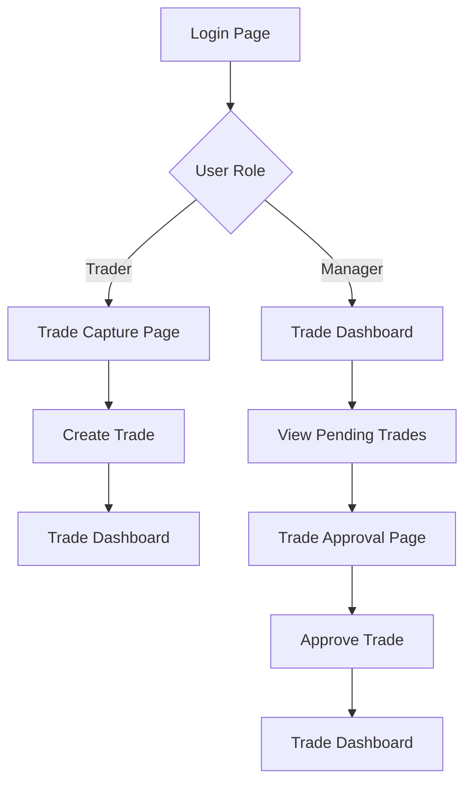

## 1. Product Overview
An OTC (Over-The-Counter) trade capture and approval system for energy trading companies. The application enables traders to efficiently record trade details with automatic ID generation and provides managers with approval workflows to finalize trades.

The system solves the problem of manual trade documentation, reduces errors through automated calculations, and streamlines the approval process for energy trading operations.

## 2. Core Features

### 2.1 User Roles
| Role | Registration Method | Core Permissions |
|------|---------------------|------------------|
| Trader | Admin assignment | Create trades, view own trades, edit draft trades |
| General Manager | Admin assignment | View all trades, approve trades, access management dashboard |

### 2.2 Feature Module
Our OTC Trade Flow application consists of the following main pages:
1. **Trade Capture Page**: Trade entry form with automatic ID generation and field validation.
2. **Trade Dashboard**: View all trades with filtering by status and division.
3. **Trade Approval Page**: Manager interface for reviewing and approving pending trades.
4. **Login Page**: User authentication with role-based access control.

### 2.3 Page Details
| Page Name | Module Name | Feature description |
|-----------|-------------|---------------------|
| Trade Capture Page | Trade Entry Form | Display form with all trade fields, validate inputs using Zod schema, auto-calculate total price, generate trade ID with format dd.mm.yyyy-00000X.Y where X is serial count and Y is division identifier |
| Trade Capture Page | Auto-calculation | Calculate total price automatically when quantity or price changes, set deal date to current date by default |
| Trade Dashboard | Trade List | Display all trades in tabular format with columns: Trade ID, Deal Date, Buyer, Seller, Product, Division, Quantity, Price, Total, Status, Actions |
| Trade Dashboard | Filters | Filter trades by status (Pending/Approved), division (Wind/Solar/Hydro), and date range |
| Trade Approval Page | Pending Trades | Show only trades with 'Pending' status, display full trade details, provide approve button for each trade |
| Trade Approval Page | Approval Action | Update trade status from 'Pending' to 'Approved', record approval timestamp and manager ID |
| Login Page | Authentication | Username/password login, role-based redirect (traders to capture page, managers to dashboard) |

## 3. Core Process

### Trader Flow
1. Trader logs into the system
2. Trader navigates to Trade Capture page
3. System automatically generates trade ID based on current date and division selection
4. Trader fills in all required fields (Buyer, Seller, Product, Division, Quantity, Price, Currency)
5. System validates inputs and auto-calculates total price
6. Trader submits the trade
7. Trade is created with 'Pending' status
8. Trader can view their trades in the dashboard

### General Manager Flow
1. Manager logs into the system
2. Manager navigates to Trade Dashboard
3. Manager can view all trades across all divisions
4. Manager filters to see only 'Pending' trades
5. Manager reviews trade details
6. Manager clicks 'Approve' on individual trades
7. System updates trade status to 'Approved'
8. Trade becomes finalized and read-only

## 4. User Interface Design

### 4.1 Design Style
- **Primary Colors**: Deep blue (#1e40af) for headers, white background
- **Secondary Colors**: Green (#10b981) for approved status, orange (#f59e0b) for pending status
- **Button Style**: Rounded corners with hover effects, primary actions in blue
- **Font**: Inter font family, 14px for body text, 16px for headers
- **Layout Style**: Card-based layout with clear sections, top navigation bar
- **Icons**: Lucide React icons for consistency

### 4.2 Page Design Overview
| Page Name | Module Name | UI Elements |
|-----------|-------------|-------------|
| Trade Capture Page | Form Section | White card background, two-column layout on desktop, single column on mobile, input fields with labels above, real-time validation messages below inputs |
| Trade Capture Page | Trade ID Display | Prominent display of generated trade ID at top of form, read-only field with copy button |
| Trade Dashboard | Trade Table | Responsive table with alternating row colors, status badges with colors (orange for pending, green for approved), action buttons in last column |
| Trade Approval Page | Trade Cards | Card-based layout showing trade details in organized sections, prominent approve button at bottom |

### 4.3 Responsiveness
Desktop-first design approach with mobile adaptation. Forms stack vertically on mobile devices. Tables become horizontally scrollable on smaller screens. Touch-optimized buttons with adequate spacing for mobile interaction.

### 4.4 Trade ID Generation Logic
The system generates trade IDs automatically using the format: dd.mm.yyyy-00000X.Y
- dd.mm.yyyy: Current date in European format
- X: Sequential number starting from 1 for each division per day
- Y: Division identifier (1=Wind, 2=Solar, 3=Hydro)

Example: 16.03.2026-000001.2 (first Solar trade of the day)