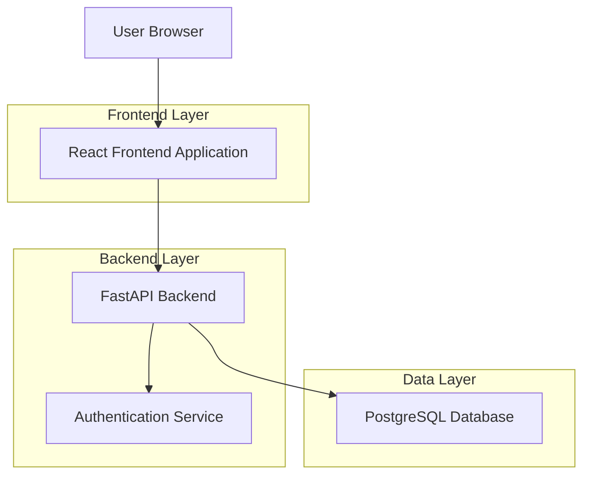
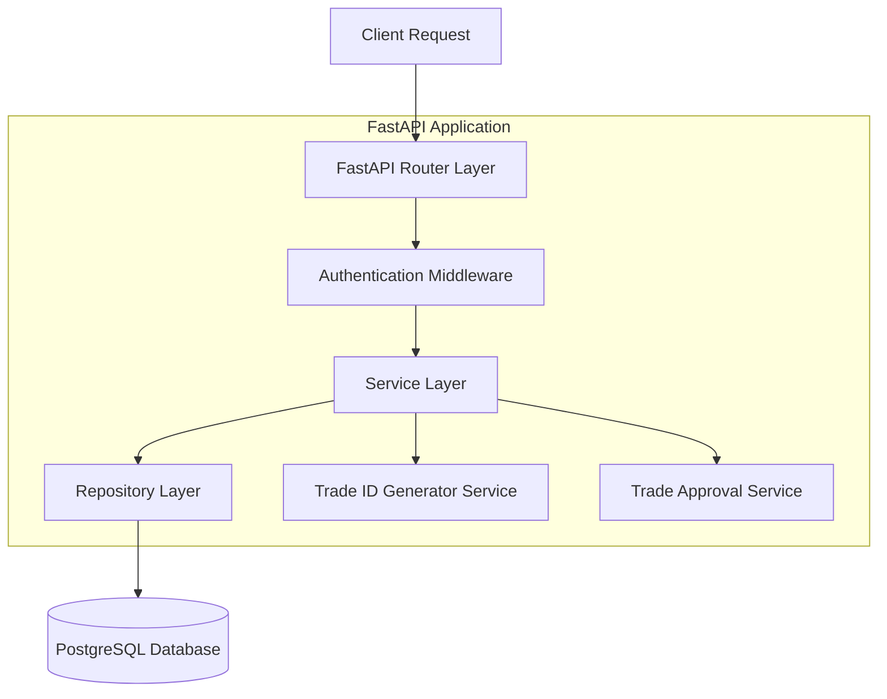
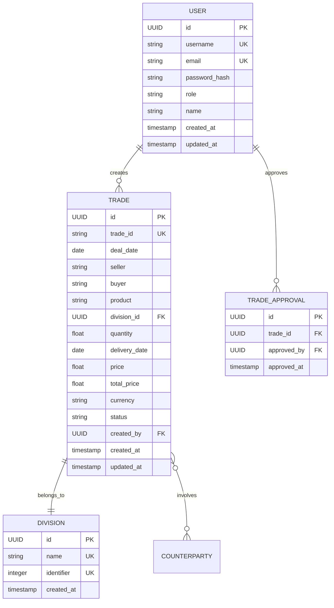

## 1. Architecture Design



## 2. Technology Description

### Frontend Technology Stack
- **Framework**: React 18 with TypeScript
- **State Management**: Zustand for global state management
- **Form Handling**: React Hook Form with Zod validation
- **UI Components**: Tailwind CSS for styling
- **HTTP Client**: Axios for API communication
- **Initialization Tool**: Vite (recommended over Create React App for better performance)

### Backend Technology Stack
- **Framework**: FastAPI (Python 3.11+)
- **Database ORM**: SQLAlchemy with async support
- **Validation**: Pydantic for request/response validation
- **Authentication**: JWT tokens with role-based access control
- **Database**: PostgreSQL 15+
- **Container**: Docker with multi-stage builds

### Tradeoff Analysis: Next.js vs React
**React + Vite (Recommended)**:
- ✅ Faster development with Vite's HMR
- ✅ Simpler deployment (static files)
- ✅ Better separation of concerns with separate backend
- ✅ More flexible architecture
- ✅ Lighter bundle size

**Next.js**:
- ✅ Built-in SSR/SSG capabilities
- ✅ API routes (but you need separate FastAPI)
- ❌ More complex for this use case
- ❌ Heavier framework overhead
- ❌ Less flexibility with external API

**Recommendation**: Use React + Vite for this project due to cleaner separation and faster development.

## 3. Route Definitions

### Frontend Routes
| Route | Purpose |
|-------|---------|
| /login | User authentication page |
| /dashboard | Main dashboard showing all trades |
| /trade-capture | Form for creating new trades |
| /trade-approval | Manager interface for approving trades |
| /trade/:id | Individual trade details view |

### Backend API Routes
| Route | Method | Purpose |
|-------|--------|---------|
| /api/auth/login | POST | User authentication |
| /api/auth/logout | POST | User logout |
| /api/trades | GET | Get all trades (with filters) |
| /api/trades | POST | Create new trade |
| /api/trades/:id | GET | Get specific trade details |
| /api/trades/:id/approve | PUT | Approve a trade (manager only) |
| /api/divisions | GET | Get available divisions |
| /api/counterparties | GET | Get list of counterparties |

## 4. API Definitions

### Authentication API
```
POST /api/auth/login
```

Request:
| Param Name | Param Type | isRequired | Description |
|------------|------------|------------|-------------|
| username | string | true | User's username |
| password | string | true | User's password |

Response:
```json
{
  "access_token": "eyJhbGciOiJIUzI1NiIsInR5cCI6IkpXVCJ9...",
  "token_type": "bearer",
  "user": {
    "id": "123e4567-e89b-12d3-a456-426614174000",
    "username": "john_trader",
    "role": "trader",
    "name": "John Doe"
  }
}
```

### Trade Creation API
```
POST /api/trades
```

Request:
| Param Name | Param Type | isRequired | Description |
|------------|------------|------------|-------------|
| seller | string | true | Counterparty name |
| buyer | string | true | Counterparty name |
| product | string | true | Product name (e.g., "NL SOLAR GVO") |
| division | string | true | Division type (Wind/Solar/Hydro) |
| quantity | number | true | Quantity in MWh |
| price | number | true | Price per product in EUR |
| currency | string | true | Currency (default: EUR) |
| delivery_date | string | true | Future delivery date (ISO format) |

Response:
```json
{
  "id": "trade_123",
  "trade_id": "16.03.2026-000001.2",
  "deal_date": "2026-03-16",
  "seller": "Energy Corp A",
  "buyer": "Trading Company B",
  "product": "NL SOLAR GVO",
  "division": "Solar",
  "quantity": 100.5,
  "price": 45.75,
  "total_price": 4597.875,
  "currency": "EUR",
  "delivery_date": "2026-04-15",
  "status": "pending",
  "created_by": "john_trader",
  "created_at": "2026-03-16T10:30:00Z"
}
```

### Trade Approval API
```
PUT /api/trades/:id/approve
```

Headers:
- Authorization: Bearer {manager_token}

Response:
```json
{
  "id": "trade_123",
  "trade_id": "16.03.2026-000001.2",
  "status": "approved",
  "approved_by": "sarah_manager",
  "approved_at": "2026-03-16T14:20:00Z"
}
```

## 5. Server Architecture Diagram



## 6. Data Model

### 6.1 Entity Relationship Diagram



### 6.2 Data Definition Language

```sql
-- Users table
CREATE TABLE users (
    id UUID PRIMARY KEY DEFAULT gen_random_uuid(),
    username VARCHAR(50) UNIQUE NOT NULL,
    email VARCHAR(255) UNIQUE NOT NULL,
    password_hash VARCHAR(255) NOT NULL,
    role VARCHAR(20) NOT NULL CHECK (role IN ('trader', 'manager')),
    name VARCHAR(100) NOT NULL,
    created_at TIMESTAMP WITH TIME ZONE DEFAULT NOW(),
    updated_at TIMESTAMP WITH TIME ZONE DEFAULT NOW()
);

-- Divisions table
CREATE TABLE divisions (
    id UUID PRIMARY KEY DEFAULT gen_random_uuid(),
    name VARCHAR(20) UNIQUE NOT NULL,
    identifier INTEGER UNIQUE NOT NULL CHECK (identifier IN (1, 2, 3)),
    created_at TIMESTAMP WITH TIME ZONE DEFAULT NOW()
);

-- Insert division data
INSERT INTO divisions (name, identifier) VALUES 
    ('Wind', 1),
    ('Solar', 2),
    ('Hydro', 3);

-- Trades table
CREATE TABLE trades (
    id UUID PRIMARY KEY DEFAULT gen_random_uuid(),
    trade_id VARCHAR(50) UNIQUE NOT NULL,
    deal_date DATE NOT NULL,
    seller VARCHAR(255) NOT NULL,
    buyer VARCHAR(255) NOT NULL,
    product VARCHAR(255) NOT NULL,
    division_id UUID NOT NULL REFERENCES divisions(id),
    quantity DECIMAL(10,2) NOT NULL CHECK (quantity > 0),
    delivery_date DATE NOT NULL,
    price DECIMAL(10,2) NOT NULL CHECK (price > 0),
    total_price DECIMAL(12,2) NOT NULL,
    currency VARCHAR(3) DEFAULT 'EUR',
    status VARCHAR(20) DEFAULT 'pending' CHECK (status IN ('pending', 'approved')),
    created_by UUID NOT NULL REFERENCES users(id),
    created_at TIMESTAMP WITH TIME ZONE DEFAULT NOW(),
    updated_at TIMESTAMP WITH TIME ZONE DEFAULT NOW()
);

-- Trade approvals table
CREATE TABLE trade_approvals (
    id UUID PRIMARY KEY DEFAULT gen_random_uuid(),
    trade_id UUID UNIQUE NOT NULL REFERENCES trades(id),
    approved_by UUID NOT NULL REFERENCES users(id),
    approved_at TIMESTAMP WITH TIME ZONE DEFAULT NOW()
);

-- Indexes for performance
CREATE INDEX idx_trades_trade_id ON trades(trade_id);
CREATE INDEX idx_trades_status ON trades(status);
CREATE INDEX idx_trades_division ON trades(division_id);
CREATE INDEX idx_trades_created_by ON trades(created_by);
CREATE INDEX idx_trades_deal_date ON trades(deal_date);
CREATE INDEX idx_trade_approvals_trade_id ON trade_approvals(trade_id);

-- Function to generate next trade ID
CREATE OR REPLACE FUNCTION generate_trade_id(division_identifier INTEGER)
RETURNS TEXT AS $$
DECLARE
    current_date TEXT;
    next_sequence INTEGER;
    trade_id TEXT;
BEGIN
    current_date := TO_CHAR(CURRENT_DATE, 'DD.MM.YYYY');
    
    -- Get next sequence number for this division and date
    SELECT COALESCE(MAX(
        CAST(SUBSTRING(trade_id FROM '\d{6}') AS INTEGER)
    ), 0) + 1 INTO next_sequence
    FROM trades 
    WHERE division_id = (SELECT id FROM divisions WHERE identifier = division_identifier)
    AND deal_date = CURRENT_DATE;
    
    -- Format sequence with leading zeros
    trade_id := current_date || '-' || LPAD(next_sequence::TEXT, 6, '0') || '.' || division_identifier;
    
    RETURN trade_id;
END;
$$ LANGUAGE plpgsql;
```

## 7. Trade ID Generation Implementation

The trade ID generation follows a sophisticated algorithm:

1. **Format**: `dd.mm.yyyy-00000X.Y`
2. **Date Component**: Current date in European format
3. **Sequence Number**: Resets daily, increments per division
4. **Division Identifier**: 1=Wind, 2=Solar, 3=Hydro

### Implementation Strategy:
- Database function `generate_trade_id()` handles ID creation
- Sequence tracking per division per day
- Zero-padding for consistent formatting
- Thread-safe implementation using database transactions

## 8. Authentication & Authorization

### JWT Token Structure:
```json
{
  "sub": "user_id",
  "username": "john_trader",
  "role": "trader",
  "exp": 1647456000
}
```

### Role-Based Access Control:
- **Traders**: Can create trades, view own trades, edit draft trades
- **Managers**: Can view all trades, approve trades, access analytics

## 9. Docker Containerization

### Multi-stage Dockerfile for Frontend:
```dockerfile
# Build stage
FROM node:18-alpine AS builder
WORKDIR /app
COPY package*.json ./
RUN npm ci --only=production
COPY . .
RUN npm run build

# Production stage
FROM nginx:alpine
COPY --from=builder /app/dist /usr/share/nginx/html
COPY nginx.conf /etc/nginx/nginx.conf
EXPOSE 80
CMD ["nginx", "-g", "daemon off;"]
```

### Dockerfile for Backend:
```dockerfile
FROM python:3.11-slim
WORKDIR /app
COPY requirements.txt .
RUN pip install --no-cache-dir -r requirements.txt
COPY . .
CMD ["uvicorn", "main:app", "--host", "0.0.0.0", "--port", "8000"]
```

### Docker Compose Configuration:
```yaml
version: '3.8'
services:
  frontend:
    build: ./frontend
    ports:
      - "3000:80"
    depends_on:
      - backend
  
  backend:
    build: ./backend
    ports:
      - "8000:8000"
    environment:
      - DATABASE_URL=postgresql://user:pass@db:5432/otc_trades
    depends_on:
      - db
  
  db:
    image: postgres:15
    environment:
      - POSTGRES_DB=otc_trades
      - POSTGRES_USER=user
      - POSTGRES_PASSWORD=pass
    volumes:
      - postgres_data:/var/lib/postgresql/data
    ports:
      - "5432:5432"

volumes:
  postgres_data:
```